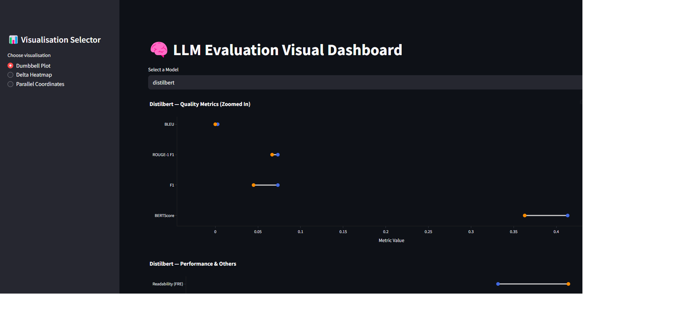

# LLM Evaluation Visualisation Dashboard

This Streamlit-based dashboard provides **interactive visualisation** of evaluation metrics for various Large Language Models (LLMs), comparing **Base**, **RAG**, and **Fine-Tuned** variants.

---
# Preview

<p align="center">
  
</p>

---

##  Features

-  **Delta Heatmap** — View differences between Base and RAG models across metrics.
-  **Dumbbell Plot** — Compare metric shifts per model.
-  **Parallel Coordinates Plot** — Visualise multiple metrics in one view (for fine-tuned Falcon).
-  Works with structured `.csv` result files stored in `/data/base` and `/data/RAG`.

---

##  Live App

 [Try it here](https://resultvisualisation.streamlit.app/)

---
##  Getting Started

1. Clone the repository:
```bash
git clone https://github.com/RahmatzadaAbdulGhafor/FYP_result_visualisation
cd FYP_result_visualisation
```

2. Install dependencies:
```bash
pip install -r requirements.txt
```

3. Run the app:
```bash
streamlit run app.py
```

---
